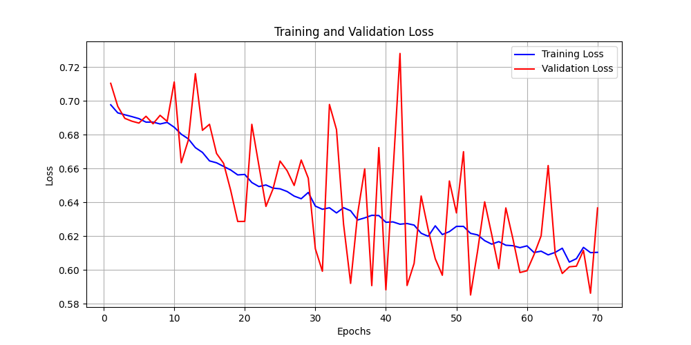
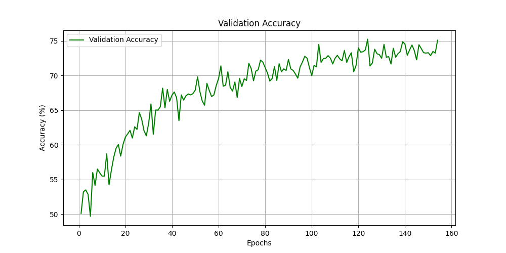
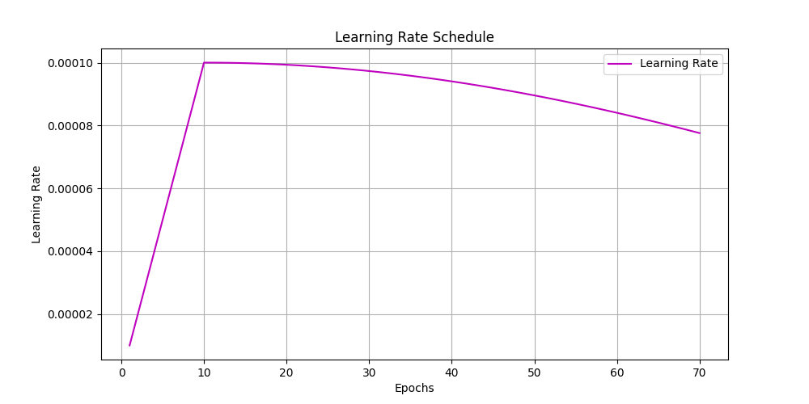

# Alzheimer's Disease Classification using GFNet

## Project Overview
This project implements a binary classification model based on GFNet to distinguish between normal and Alzheimer's disease (AD) brain scans from the ADNI dataset. The goal is to achieve a minimum accuracy of $0.8$ on the test set.

To implement this, PyTorch will be used to develop and train the GFNet architecture.

## GFNet (Global Filter Network)
GFNet is a new neural network architecture that replaces the normal local convolution operation with global filtering in the frequency domain. Instead of learning spatial kernels (like in a normal CNN), GFNet performs a 2D Fourier transform on input feature map, applies learnable filters in the frequency domain to capture long range dependencies efficiently, then transforms the result back into the spatial domain using the inverse Fourier transformation.

Basically, GFNet treats the image as a global signal and learns how to manipulate its frequency components directly, rather than relying on local spatial features extracted by small convolutional kernels.

This allows GFNet to model global relationships across the entire image in a single operation. As a result, it achieves a balance between the efficiency of CNNs and the long range dependency modelling of transformers.

In this project, we will be using the GFNetPyramid model (which uses a hierarchical architecture to learn smaller details of the image in the early layers and more abstract, global features in the later layers) instead of the standard GFNet model.

## Dataset and Pre-processing

### Data Source and Splits
The project uses the pre-processed ADNI dataset, which is organized into two main directories: `AD_NC/train` and `AD_NC/test`.Each directory contains subfolders for the two classes:
* **NC**: Normal Control
* **AD**: Alzheimer's Disease

To ensure robust evaluation and prevent "test set leakage," the `train.py` script splits the `train` directory into two parts:
1.  **Training Set (90%):** Used to train the model.
2.  **Validation Set (10%):** Used to monitor performance during training, select the best model, and for early stopping.
3.  **Test Set:** The `AD_NC/test` directory is used *only once* at the very end to report the final, unbiased performance of the best model.

This split strategy is justified as it provides a robust mechanism for model selection (using the validation set) without biasing the results on the final test set.

### Data Augmentation
To prevent overfitting and make the model more robust, the following pre-processing and augmentation techniques are applied to the training images[cite: 160]:
* `transforms.RandomResizedCrop`: Randomly crops and resizes the image.
* `transforms.RandomHorizontalFlip`: Flips the image horizontally.
* `transforms.RandomRotation(15)`: Rotates the image by up to 15 degrees.
* `transforms.RandAugment()`: Applies a series of automatically-selected augmentations.
* `transforms.ToTensor()`: Converts the image to a PyTorch tensor.
* `transforms.Normalize(mean=[0.5], std=[0.5])`: Normalizes the single-channel (grayscale) image tensor.

The validation and test sets are only resized, converted to tensors, and normalized.

## Model Architecture
The model is a `GFNetPyramid` built from scratch, as defined in `modules.py`. The specific architecture used in `train.py` is:
* **Patch Size:** $16 \times 16$
* **Embedding Dimensions (Per Stage):** `[64, 128, 256, 512]`
* **Block Depth (Per Stage):** `[3, 3, 9, 3]`
* **MLP Ratio:** $4$ (for all stages)
* **Drop Path Rate:** $0.15$
* **Number of Classes:** $1$ (using a single output logit for binary classification)

This results in a model with **21.84M** trainable parameters.

## Training Strategy
The model was trained from scratch for 200 epochs using the following setup:
* **Loss Function:** `nn.BCEWithLogitsLoss()` (Binary Cross-Entropy), suitable for a single-logit binary classifier.
* **Optimizer:** `torch.optim.AdamW`
* **Learning Rate:** `3e-5` (a small, stable rate for training from scratch)
* **Scheduler:** A 10-epoch linear warmup followed by a `CosineAnnealingLR` schedule.
* **Regularization:**
    * **Weight Decay:** A strong L2 penalty of `0.05` was used to control overfitting.
    * **MixUp:** A custom `Mixup` function was applied with an $\alpha$ of `0.8` and a probability of `1.0`. This blends training images and their labels, acting as a powerful regularizer.
* **Mixed Precision:** `torch.amp.GradScaler` was used for automatic mixed precision (AMP) to speed up training.

## Requirements
This project requires the following Python libraries:
* `torch` (PyTorch)
* `torchvision`
* `numpy`
* `matplotlib`
* `tqdm`
* `Pillow (PIL)`
* `timm` (required by `modules.py`)

## Usage

### Training the Model
To train the model from scratch, run the `train.py` script. The data must be in a root directory (e.g., `AD_NC`) with `train` and `test` subfolders, which in turn contain `AD` and `NC` subfolders.

```bash
python train.py \
    --data-dir AD_NC \
    --output-dir checkpoints \
    --epochs 200 \
    --batch-size 32 \
    --lr 3e-5 \
    --weight-decay 0.05 \
    --mixup-alpha 0.8
```

### Running a Prediction
Use the `predict.py` script to run a prediction on a single image using your saved `best_model.pth`.

```bash
python predict.py \
    --image-path /path/to/your/image.jpeg \
    --model-path checkpoints/best_model.pth
```

## Results and Evaluation
The model's performance is tracked by saving the best model based on validation accuracy. The goal is to achieve an accuracy of 80% or higher on the final, held-out test set. It can be seen below that it was supposed to run 200 epochs, but it stopped early because there was not an improvement in the validation accuracy for 30 epochs.

### Training and Validation Metrics
The following plots show the model's performance during training on the training and validation sets.





### Final Test Set Performance
After training, the we run the model with the best validation accuracy (`0.7579`) on on the **test set**.

* **Final Test Loss:** `0.5175`
* **Final Test Accuracy:** `0.7434`

## References
[1] Y. Rao, W. Zhao, Z. Zhu, J. Zhou, and J. Lu, “GFNet: Global Filter Networks for Visual Recognition,” IEEE Transactions on Pattern Analysis and Machine Intelligence, vol. 45, no. 9, pp. 10 960–10 973, Sep. 2023. [Online]. Available: https://ieeexplore.ieee.org/document/10091201?denied=
